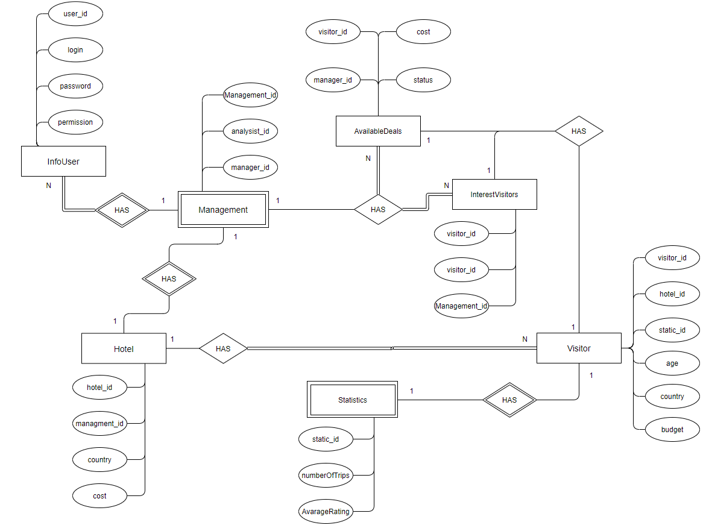

# Бронь и сттистика отелей

## ЛР1

### Краткое описание идеи проекта

Данный проект дает возможность заказа отеля, совершение сделки через менеджера, приглашение потенциальных посетителей в отель.  Также производиться сбор статистики, но не по отелям, а по посетителям, а именно "Сколько поездок он совершил за все время?" и "Какую среднюю оценку он поставил отелям?". 

### Краткое описание предметной области

Предметной областью является отельный бизнес. Верное ведение записи приезда / уезда посетителей, средняя оценка отелю от посетителей. У каждого отеля есть "отдел" менежмента, в который входят менеджер отеля и хостес. Менеджер в свою очередь вправе совершать сделки, а хостес добавлять или удалять посетителей при въезде и при вызде соответственно. 

### Краткий анализ аналогичных решений по 3 критериям.

| Название       | Оплата    | "Производство"  | Бронь | Подбор посетителей |
| -------------- | ------------ | ----- | --------- | ---- |
| Ostrovok.ru  | Через сайт или на месте | Россия | Напрямую (на сайте отеля) | Нет  |
| Туту.ру Отели   | В любое время (без посредников)  | Россия | На сайте отеля или на сайте Туту.ру | Нет  |
| Командировка.ру | Нет услуги оплаты | Россия | Нет услуги бронирования | Нет  |
| Agoda.com | Оплата через сайт | Сингапур | На сайте Agoda | Нет  |

### Use-case диаграмма

### ER-диаграмма сущностей

