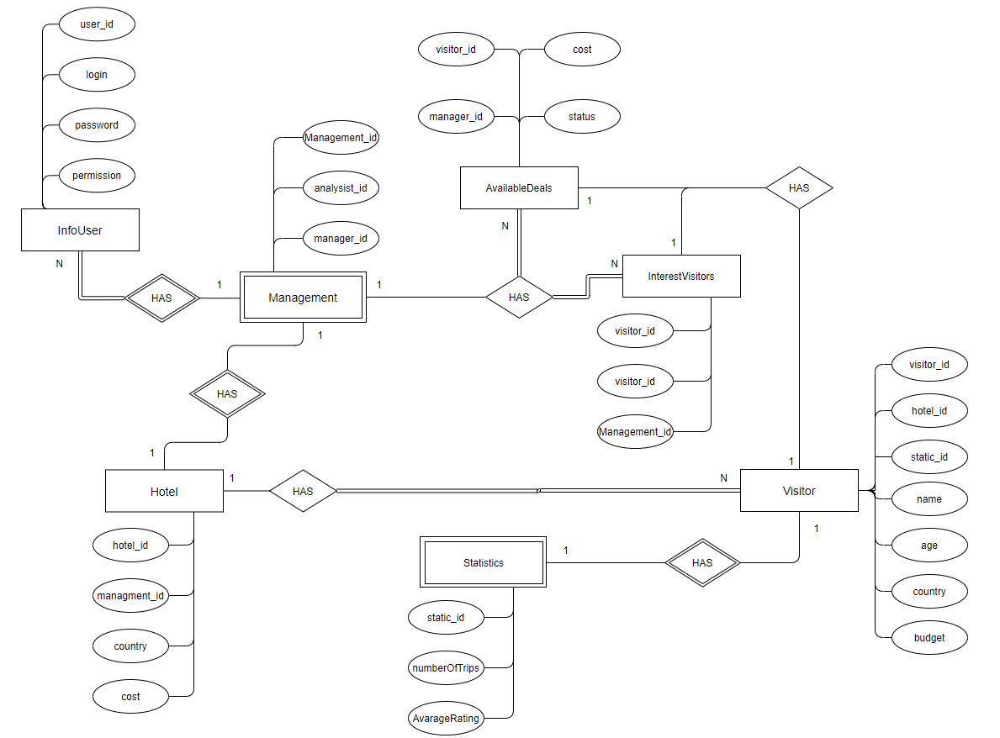
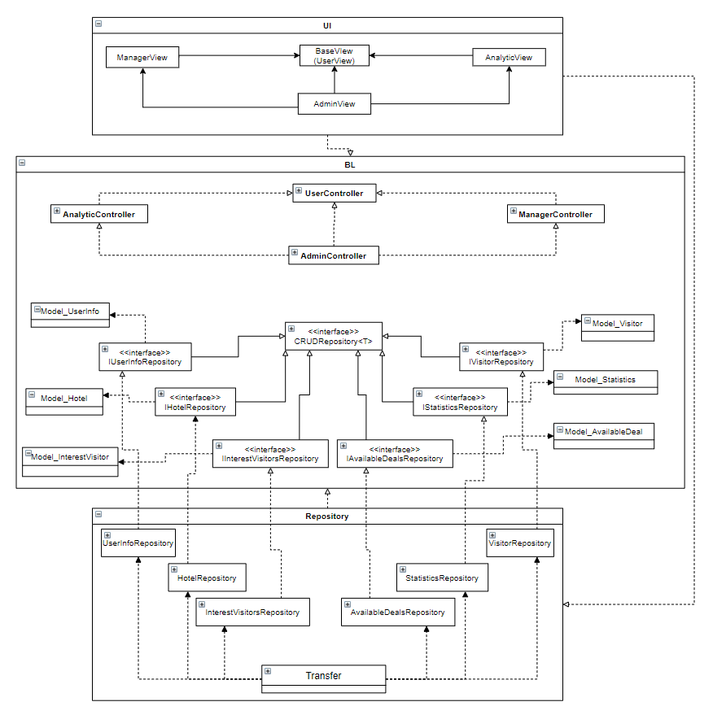
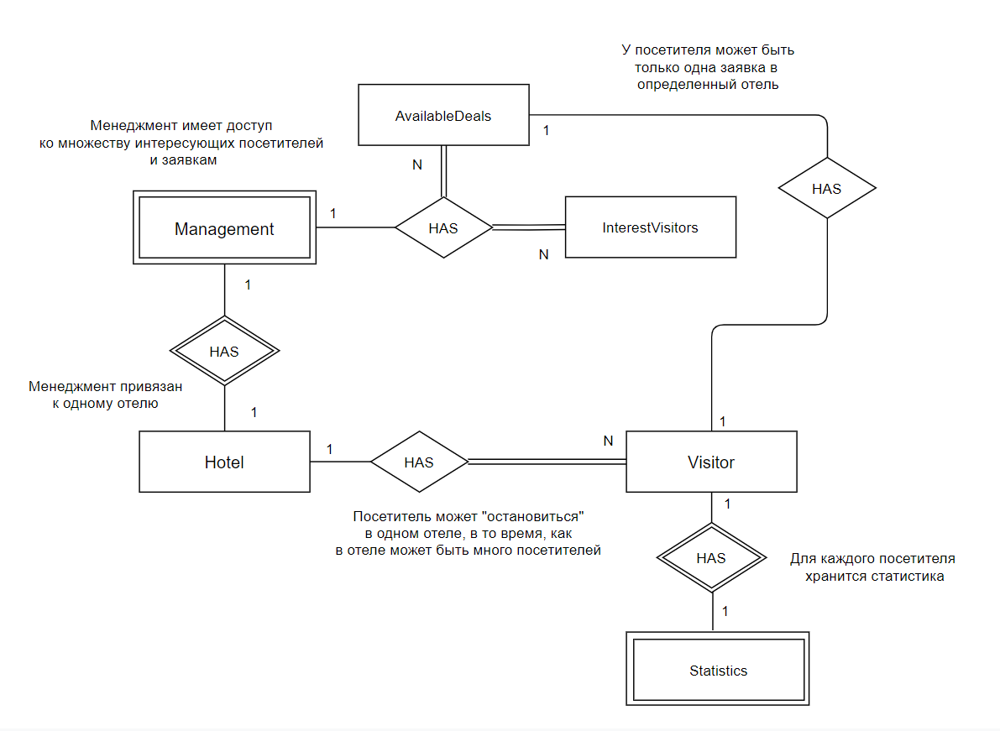

# **Бронь и статистика отелей**

1. [Лабораторная работа №1](#lr1)
   1. [Краткое описание идеи проекта](#about1)
   2. [Краткое описание предметной области](#about2)
   3. [Краткий анализ аналогичных решений](#an3)
   4. [Use-case диаграмма](#usecase)
   5. [ER-диаграмма сущностей](#er)
2. [Лабораторная работа №2](#lr2)
   1. [Описание типа приложения и выбранного технологического стека](#lr21)
   2. [Верхнеуровневое разбиение на компоненты](#lr22)
   3. [UML диаграммы классов для двух отдельных компонентов](#lr23)
   4. [UML диаграммы «модельных» классов сущностей](#lr24)

## Лабораторная работа №1 

### Краткое описание идеи проекта 

Необходимо реализовать БД, интерфейс для доступа к данным, а также наполнить базу данными необходимыми данными для работы приложения. 

Данный проект дает возможность заказа отеля, совершение сделки через менеджера, приглашение потенциальных посетителей в отель.  Также производиться сбор статистики, но не по отелям, а по посетителям, а именно "Сколько поездок он совершил за все время?" и "Какую среднюю оценку он поставил отелям?". 

Есть пользователи: Гость, Аналитиик (он же хостес), Менеджер, а также Администратор или Модератор (права как у разрабочика).

### Краткое описание предметной области 

Предметной областью является отельный бизнес. Верное ведение записи приезда / уезда посетителей, средняя оценка отелю от посетителей. У каждого отеля есть "отдел" менежмента, в который входят менеджер отеля и хостес (анатилик). Менеджер в свою очередь вправе совершать сделки, а хостес добавлять или удалять посетителей при въезде и при вызде соответственно. 

### Краткий анализ аналогичных решений по (минимум) 3 критериям 

| Название      | Производитель    | Оформление подписки | Программа лояльности  | Отображение оценки пользователей | Обязательная регистрация |
| -------------- | ------------ | ----- | --------- | ---- | ---- |
| Hotellook.ru   | Россия | Подписка на отель | Есть | Есть  | Нет | 
| Agoda.com   | Сингапур | Нет | Есть | Нет  | Нет |
| Booking.com | Нидерланды | Нет | Есть | Есть | Нет | 
| OSTROVOK.RU | Россия | Нет | Есть | Нет  | Нет |

Ни какое приложение выше не дает возможности приглашать гостей в отель. 

### Use-case диаграмма 

 
### ER-диаграмма сущностей 

## Лабораторная работа №2 

### Описание типа приложения и выбранного технологического стека 

Тип приложения - Desktop

Технологический стек - C#, PostgreSQL, Windows Form

В качестве СУБД выбор сделан в строну PostgreSQL.

|  | Oracle | MySQL | Microsoft SQL Server | PostgreSQL |
| --- | --- | --- | --- | --- |
| Простота в использовании | + | + | + | + |
| Бесплатная | - | + | - | + |
| Безопасность данных | + | - | + | + |
| Поддержка стандарта SQL | + | - | + | + |
| Поддержка хранимых процедур и триггеров | + | + | + | + |
| Кросплатформенность | + | + | - | + |

В качестве языка программирования выбор сделан в сторону C#. Этот язык имеет удобные пакеты для работы с PostgreSQL, а также он объектно-ориентированный, что позволяет использовать наследование, интерфейсы, абстракции и т.д.

### Верхнеуровневое разбиение на компоненты (в будущем может быть утонченно): на базовом уровне выделяем компонент доступа к данным, компонент бизнес-логики и компонент реализации UI 

### UML диаграммы классов для двух отдельных компонентов - компонента доступа к данным и компонента с бизнес-логикой 

### UML диаграммы «модельных» классов сущностей: сущности базы данных, сущности системы и транспортные сущности 

#### Сущности БД

#### Сущности системы

#### UML диаграмма компонентов + технический ui

#### UML диаграмма компонентов + gui

