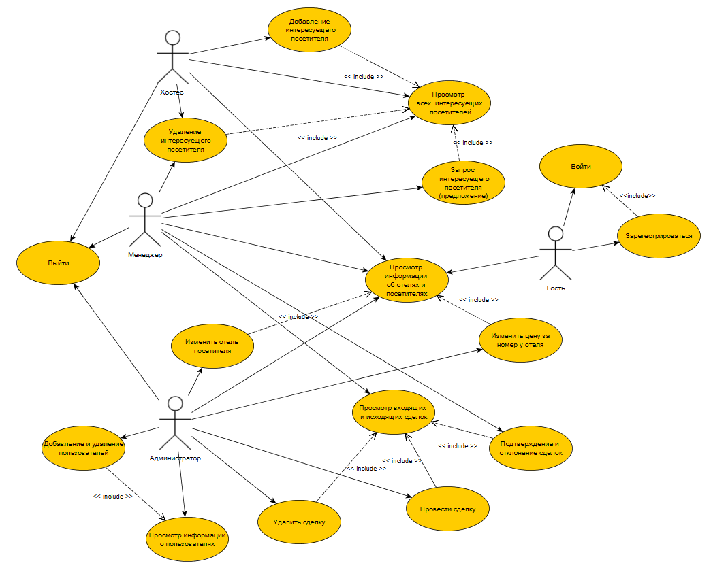

# Бронь и статистика отелей

## Лабораторная работа № 1

### Краткое описание идеи проекта

Необходимо реализовать БД, а также интерфейс для доступа к данным.

Данный проект дает возможность заказа отеля, совершение сделки через менеджера, приглашение потенциальных посетителей в отель.  Также производиться сбор статистики, но не по отелям, а по посетителям, а именно "Сколько поездок он совершил за все время?" и "Какую среднюю оценку он поставил отелям?". 

Есть пользователи: Гость, Аналитиик (он же хостес, название "Хостес" -- просто заменено на более удобное при использовании в проектировании, так как есть таблица "Отель", что на английском Hotel схоже с Hostesses), Менеджер, а также Администратор или модератор -- то есть есть все права, как у разработчика).

### Краткое описание предметной области

Предметной областью является отельный бизнес. Верное ведение записи приезда / уезда посетителей, средняя оценка отелю от посетителей. У каждого отеля есть "отдел" менежмента, в который входят менеджер отеля и хостес. Менеджер в свою очередь вправе совершать сделки, а хостес добавлять или удалять посетителей при въезде и при вызде соответственно. 

### Краткий анализ аналогичных решений по 3 критериям.

| Название      | Производитель    | Оформление подписки | Программа лояльности  | Отображение оценки пользователей | Обязательная регистрация |
| -------------- | ------------ | ----- | --------- | ---- | ---- |
| Hotellook.ru   | Россия | Подписка на отель | Есть | Есть  | Нет | 
| Agoda.com   | Сингапур | Нет | Есть | Нет  | Нет |
| Booking.com | Нидерланды | Нет | Есть | Есть | Нет | 
| OSTROVOK.RU | Россия | Нет | Есть | Нет  | Нет |

Ни какое приложение выше не дает возможности приглажать гостей в отель.

Приложение дает возможность как и заказывать отели, а также и со стороны отеля приглашать гостей. Создаются непосредственно сделки, их можно подтвердить или опровергнуть.

### Use-case диаграмма

### ER-диаграмма сущностей

## Лабораторная работа № 2

### Описание типа приложения и выбранного технологического стека (Console App/Desktop/Mobile/Web MPA/ Web SPA/Cross-platform)
Тип приложения - Desktop

Технологический стек - C#, PostgreSQL, Windows Form

В качестве СУБД выбор сделан в строну PostgreSQL.

|  | Oracle | MySQL | Microsoft SQL Server | PostgreSQL |
| --- | --- | --- | --- | --- |
| Простота в использовании | + | + | + | + |
| Бесплатная | - | + | + | + |
| Безопасность данных | + | - | + | + |
| Поддержка стандарта SQL | + | + | + | + |
| Поддержка хранимых процедур и триггеров | + | + | + | + |
| Кросплатформенность | + | + | - | + |

В качестве языка программирования выбор сделан в сторону C#. Этот язык имеет удобные пакеты для работы с PostgreSQL, а также он объектно-ориентированный, что позволяет использовать наследование, интерфейсы, абстракции и т.д.

### Верхнеуровневое разбиение на компоненты (в будущем может быть утонченно): на базовом уровне выделяем компонент доступа к данным, компонент бизнес-логики и компонент реализации UI

### UML диаграммы классов для двух отдельных компонентов - компонента доступа к данным и компонента с бизнес-логикой
#### Компонент доступа к данным

#### Компонент с бизнес-логикой

### UML диаграммы «модельных» классов сущностей: сущности базы данных, сущности системы и транспортные сущности. Если уровень транспортных сущностей пока сложно спроектировать, можно скопировать системные. Уточните их на следующих этапах

#### Сущности БД

#### Сущности системы

#### Транспортные сущности
