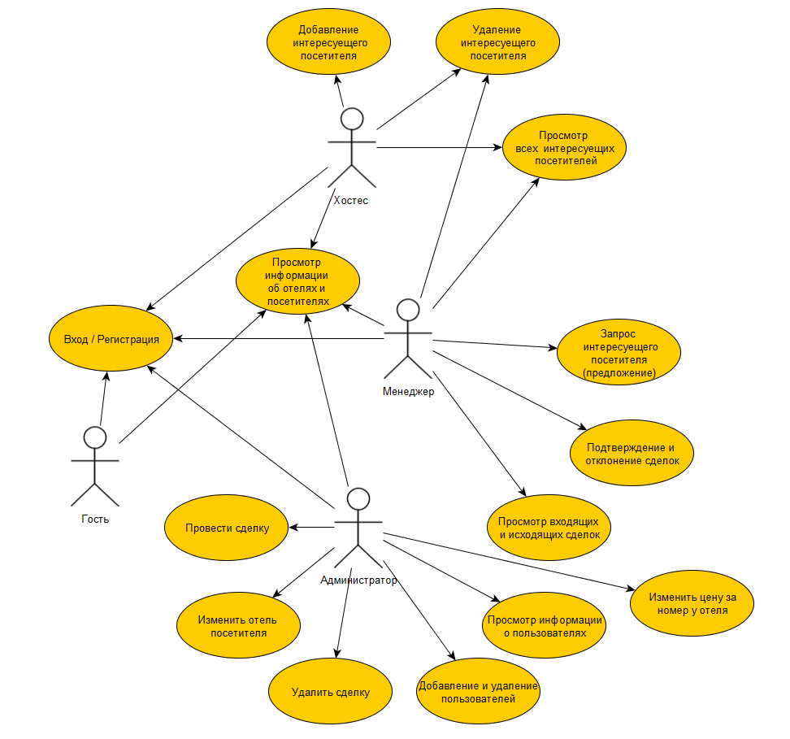

# Бронь и сттистика отелей

## Лабораторная работа № 1

### Краткое описание идеи проекта

Данный проект дает возможность заказа отеля, совершение сделки через менеджера, приглашение потенциальных посетителей в отель.  Также производиться сбор статистики, но не по отелям, а по посетителям, а именно "Сколько поездок он совершил за все время?" и "Какую среднюю оценку он поставил отелям?". 

### Краткое описание предметной области

Предметной областью является отельный бизнес. Верное ведение записи приезда / уезда посетителей, средняя оценка отелю от посетителей. У каждого отеля есть "отдел" менежмента, в который входят менеджер отеля и хостес. Менеджер в свою очередь вправе совершать сделки, а хостес добавлять или удалять посетителей при въезде и при вызде соответственно. 

### Краткий анализ аналогичных решений по 3 критериям.

| Название      | Производитель    | Оформление подписки | Программа лояльности  | Отображение оценки пользователей | Обязательная регистрация |
| -------------- | ------------ | ----- | --------- | ---- | ---- |
| Hotellook.ru   | Россия | Подписка на отель | Есть | Есть  | Нет | 
| Agoda.com   | Сингапур | Нет | Есть | Нет  | Нет |
| Booking.com | Нидерланды | Нет | Есть | Есть | Нет | 
| OSTROVOK.RU | Россия | Нет | Есть | Нет  | Нет |

### Use-case диаграмма

### ER-диаграмма сущностей

